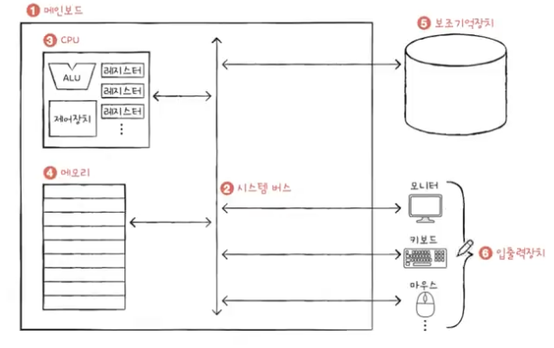

✅ 가볍게 훑기

# 컴퓨터구조 거시적으로 보기

## Q 컴퓨터 구조

* 컴퓨터 부품을 학습하는 과목
* 모든 프로그램은 컴퓨터 부품이 실행한다 : 성능 & 용량 & 비용 <- 컴퓨터 공학을 공부하는 이유

---

## Q 컴퓨터 구조를 학습한다?

* 프로그램을 이루는 두 정보 (0과 1로 이루어진 정보)
    
    * 명령어 : 컴퓨터를 동작시키는 실질적인 정보
        
    * 데이터 : 명령어의 대상 ( 재료 )

---

## Q 컴퓨터의 핵심 부품 4가지

* CPU : 명령어 fetch 및 해석, 실행 담당 장치

* 메인 메모리(메모리) & 캐시 메모리 : 실행 중인 프로그램을 저장(프로세스 저장), 전원이 꺼지면 삭제

* 보조기억장치 : 보관할 프로그램 저장하는 장치, 전원이 꺼져도 저장 유지

* 입출력장치 : 컴퓨터 내외부와 정보를 주고 받는 장치

---

## Q 컴퓨터의 핵심 부품의 종류 및 추가 내용

* CPU : 레지스터, ALU(계산기 회로), 제어 장치(명령어 해석, 제어 신호)

* 메인 메모리(메모리) & 캐시 메모리 : 주소

* 보조기억장치 

* 입출력장치 : 컴퓨터 내외부와 정보를 주고 받는 장치

* 메인 보드 (마더보드) : 핵심 부품을 연결할 기판

    * (시스템) 버스 : 부품 간 정보를 주고 받을 통로

---

# 명령어

## Q 컴퓨터는 소스 코드를 이해할 수 있을까?

* 아니요
* 소스 코드 : 사람(개발자)가 이해하기 편한 언어 - 고급 언어
* 명령어와 데이터 : 컴퓨터가 이해하기 편한 언어 - 저급 언어
* 고급언어로 작성된 소스코드는 내부적으로 저급 언어로 구성된 명령어로 변환된다.

---

## Q 저급 언어 두 종류

* 기계어 : 컴퓨터가 직접 이해하는 언어
* 어셈블리어 : 기계어를 사람이 읽기 편하게 변환시킨 언어
* CPU 와 소프트웨어에 따라서 종류가 달라질 수 있다.

---

## Q 고급 언어에서 저급 언어로 변환되는 대표적 방식

* 컴파일 방식
    * 소스 코드 전체가 컴파일러에 의해 검사, 목적 코드로 변환
    * C / C++, Rust
    * gcc, clang

* 인터프리터 방식
    * 소스 코드 한 줄씩 인터프리터에 의해 검사, 목적 코드로 변환
    * Python, JS

❗️ 명확히 구분되지는 않는다.

---

# 컴파일 - 명령어 관찰하기

## Q 소스코드가 명령어로 변환되는 과정 관찰

* 사이트 참고 : [소스코드가 어떻게 명령어가 되는지 관찰 가능한 사이트](https://godbolt.org/)

* 터미널 : 파일을 cc -S hello.c 로 실행하면 hello.s 파일이 생기고, cat 하면 나옴

---

